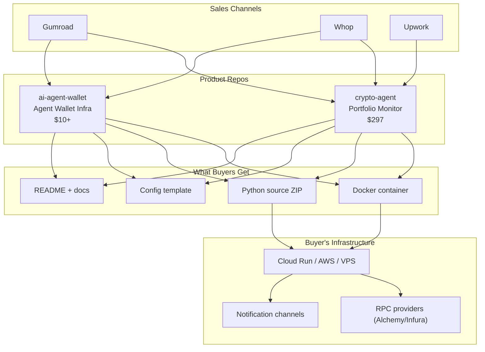

# Intent Solutions — Products Workspace

> **Premade digital products sold on [Gumroad](https://intentsolutions.gumroad.com) and [Whop](https://whop.com). Self-hosted tools for crypto, AI agents, and automation.**

---

## Products

| Product | Price | Description | Repo | Marketplace |
|---------|-------|-------------|------|-------------|
| **Crypto Portfolio Agent** | $297 | Read-only portfolio monitoring for EVM chains. Tracks balances, DeFi positions, alerts, and reports. | [crypto-agent](https://github.com/intent-solutions-io/crypto-agent) | [Gumroad](https://intentsolutions.gumroad.com) |
| **AI Agent Wallet** | $10+ | Self-hosted wallet infrastructure for AI agents. Guardrails, kill switch, audit logging. | [ai-agent-wallet](https://github.com/intent-solutions-io/ai-agent-wallet) | [Gumroad](https://intentsolutions.gumroad.com) |

## Architecture



## Product Details

### Crypto Portfolio Agent — $297

Read-only monitoring tool for cryptocurrency wallets across EVM chains.

**What it does:**
- Monitors wallet balances (native + ERC-20) across Ethereum, Polygon, Arbitrum, Optimism, Base
- Tracks DeFi positions (Aave V3, Uniswap V3 LP, Lido stETH)
- 6 alert types: price threshold, balance change, whale movement, liquidation risk, gas threshold, transaction detected
- 4 notification channels: webhook, email (SMTP), Telegram, Slack
- JSON portfolio reports on schedule
- Safety: read-only hardcoded, 100 alerts/day cap, 15-min dedup

**Stack:** Python, Docker, CoinGecko API, JSON-RPC, The Graph subgraphs

### AI Agent Wallet — $10+

Self-hosted wallet infrastructure for autonomous AI agents.

**What it does:**
- Create and manage wallets via REST API
- Execute transactions with 8 guardrail types (per-tx limit, daily/monthly caps, address whitelist, contract whitelist, cooldown, large-tx delay, kill switch)
- Encrypted key storage (Fernet/AES)
- Full audit logging of all API calls and transactions
- Multi-chain EVM support

**Stack:** Python, FastAPI, web3.py, SQLite, Docker

## Common Patterns

All products follow consistent patterns:

| Pattern | Detail |
|---------|--------|
| **Delivery** | Docker container + Python source ZIP + config template |
| **License** | Non-exclusive, non-transferable, perpetual usage |
| **Warranty** | 7-day defect warranty |
| **Support** | Not included; paid add-on ($200/mo) |
| **Acceptance** | `doctor` command produces verifiable test report |
| **Secrets** | Environment variables only; never in config/logs |
| **Safety** | Read-only defaults, rate limits, guardrails |

## Paid Add-Ons

| Add-On | Price | Description |
|--------|-------|-------------|
| Onboarding Call | $150-200 | 60-min screenshare setup |
| Managed Deployment | $300-400 | Deploy to buyer's infrastructure |
| Support Subscription | $200-300/mo | 4 hrs/mo, 48hr response |
| Updates Subscription | $100/mo | Patches, new features |

## Getting Started (Development)

```bash
# Clone the workspace
git clone https://github.com/intent-solutions-io/products-workspace.git products
cd products

# Clone individual product repos
git clone https://github.com/intent-solutions-io/crypto-agent.git
git clone https://github.com/intent-solutions-io/ai-agent-wallet.git

# Each product has its own setup — see their READMEs
```

## Sales Channels

| Channel | Status | Products |
|---------|--------|----------|
| Gumroad | Live | Crypto Agent, AI Agent Wallet |
| Whop | Setting up | Crypto Agent, AI Agent Wallet |
| Upwork | Live | Crypto Agent |

## License

All products are proprietary. Source code is delivered under commercial license. See individual product repos for license terms.

---

*Intent Solutions — jeremy@intentsolutions.io*
