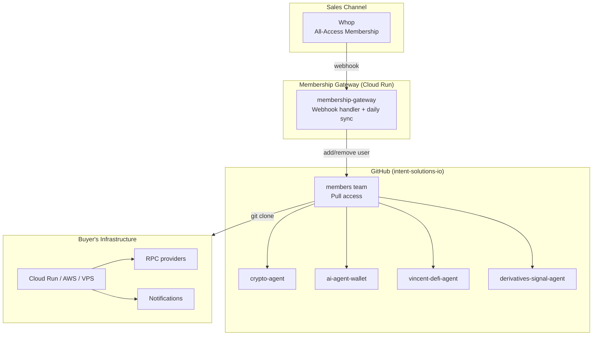

# Intent Solutions — Products Workspace

> **AI crypto agents sold via [Whop All-Access membership](https://whop.com/intentsolutions). Self-hosted tools for portfolio monitoring, wallet infrastructure, DeFi trading, and derivatives analysis.**

---

## All-Access Membership

One membership, all agents, all updates.

| Plan | Price | Type |
|------|-------|------|
| Monthly | $29/mo | Renewal |
| Annual | $249/yr | Renewal (~28% discount) |
| Lifetime | $199 | One-time (limited to 50 seats) |

**What's included:**
- Full source code access to all 4 AI crypto agents (and future agents)
- All updates as long as membership is active
- Private GitHub repo access via organization team
- Docker containers + config templates + AI setup wizard

**How it works:**
1. Purchase membership on Whop, enter your GitHub username
2. Accept the GitHub organization invitation (from intent-solutions-io)
3. Clone any repo and follow the README
4. Run `doctor` to verify your setup

## Products

| Product | Description | Repo |
|---------|-------------|------|
| **Crypto Portfolio Agent** | Read-only portfolio monitoring for EVM chains. Tracks balances, DeFi positions, alerts, and reports. | [crypto-agent](https://github.com/intent-solutions-io/crypto-agent) |
| **AI Agent Wallet** | Self-hosted wallet infrastructure for AI agents. Guardrails, kill switch, audit logging. | [ai-agent-wallet](https://github.com/intent-solutions-io/ai-agent-wallet) |
| **Vincent DeFi Agent** | DeFi trading agent with cryptographic guardrails (Lit Protocol TEE). Swaps, sends, DCA on Base. | [vincent-defi-agent](https://github.com/intent-solutions-io/vincent-defi-agent) |
| **Derivatives Signal Agent** | AI-powered derivatives analysis. Aggregates funding, OI, liquidations, L/S ratios. Claude AI scoring. | [derivatives-signal-agent](https://github.com/intent-solutions-io/derivatives-signal-agent) |

All products include an **AI-guided setup wizard** (`/agent-setup` for Claude Code, or SETUP-PROMPT.md for any AI assistant).

## Architecture

## Product Details

### Crypto Portfolio Agent

Read-only monitoring tool for cryptocurrency wallets across EVM chains.

- Monitors wallet balances (native + ERC-20) across Ethereum, Polygon, Arbitrum, Optimism, Base
- Tracks DeFi positions (Aave V3, Uniswap V3 LP, Lido stETH)
- 5 alert types: price threshold, balance change, liquidation risk, gas threshold, transaction detected
- 4 notification channels: webhook, email (SMTP), Telegram, Slack
- Safety: read-only hardcoded, 100 alerts/day cap, 15-min dedup

**Stack:** Python, Docker, CoinGecko API, JSON-RPC, The Graph subgraphs

### AI Agent Wallet

Self-hosted wallet infrastructure for autonomous AI agents.

- Create and manage wallets via REST API
- Execute transactions with 8 guardrail types (per-tx limit, daily/monthly caps, address whitelist, contract whitelist, cooldown, large-tx delay, kill switch)
- Encrypted key storage (Fernet/AES)
- Full audit logging of all API calls and transactions

**Stack:** Python, FastAPI, web3.py, SQLite, Docker

### Vincent DeFi Agent

DeFi trading agent with cryptographic guardrails enforced by Lit Protocol's TEE network.

- 4 abilities: native send, ERC-20 transfer, Uniswap V3 swap, DCA (all on Base chain)
- 4 cryptographic policies: rate limiter, spending limit, address whitelist, stop-loss
- Guardrails run inside TEE hardware — agent physically cannot bypass them

**Stack:** TypeScript, Nx/pnpm monorepo, Lit Protocol SDK, ethers.js

### Derivatives Signal Agent

AI-powered derivatives market analysis with directional bias scoring.

- Aggregates 8 data sources per symbol: funding rates, open interest, order book depth, liquidations, long/short ratios
- Data from Bybit (free) and Coinglass ($29/mo, buyer pays)
- Claude AI analysis produces directional bias scores (-100 to +100)
- REST API for custom integrations, SQLite or Supabase storage
- Safety: read-only hardcoded, daily limits, cost caps, SEC disclaimers

**Stack:** Python, FastAPI, Claude AI, Bybit API v5, Coinglass API, Docker

## Common Patterns

| Pattern | Detail |
|---------|--------|
| **Delivery** | GitHub repo access via membership |
| **License** | Non-exclusive, non-transferable; access while subscribed |
| **Acceptance** | `doctor` command produces verifiable test report |
| **Secrets** | Environment variables only; never in config/logs |
| **Safety** | Read-only defaults, rate limits, guardrails |
| **Anti-piracy** | `membership_id` watermark in config, webhook-driven access revocation |

## Sales Channels

| Channel | Status | Model |
|---------|--------|-------|
| Whop | Live | All-Access membership ($29/mo, $249/yr, $199 lifetime) |
| Gumroad | Live (legacy) | Individual product sales |

## License

All products are proprietary. Source code access is granted via membership under commercial license terms. See individual product repos for details.

---

*Intent Solutions — jeremy@intentsolutions.io*
